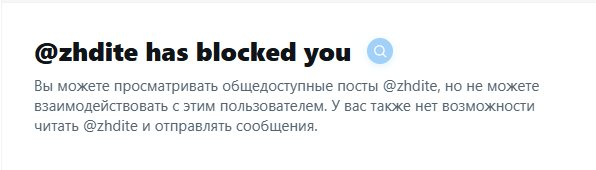

# Twitter Block Search (Tampermonkey)

Скрипт для **Tampermonkey** в браузерах Chrome, Edge, Firefox, Brave и других: на странице профиля пользователя в X/Twitter, который вас заблокировал, ищет вашу взаимную переписку и даёт быстрый переход к найденным сообщениям.

---

## Что делает

- При открытии профиля заблокировавшего вас пользователя запускает поиск ваших сообщений в переписке.
- Кнопка аккуратно размещается на правом краю карточки уведомления о блокировке.
- Во время фоновой проверки показывает мигающую лупу.
- **Если сообщения найдены:** синяя лупа остаётся, по клику открывается найденная переписка.
- **Если сообщений нет:** выводится клоун 🤡, по клику также можно перейти к поиску, чтобы убедиться лично.
- **Языконезависимость:** работает на любом языке интерфейса (русский, английский, испанский, немецкий и др.).
- **Надежность:** скрипт не удаляется браузером при обновлениях или очистке кэша (в отличие от распакованных расширений Chrome).

---

## Установка

1. Установите расширение [Tampermonkey](https://www.tampermonkey.net/) из официального магазина расширений вашего браузера.
2. Откройте панель управления Tampermonkey и перейдите во вкладку **«+» (Создать новый скрипт)**.
3. Скопируйте весь код из файла [`Twitter_Block_Search.user.js`](Twitter_Block_Search.user.js) и вставьте его в редактор Tampermonkey.
4. Нажмите **Файл -> Сохранить** (`Ctrl+S`).

---

## Как пользоваться

1. Откройте профиль пользователя, который вас заблокировал (например, `https://x.com/username`).
2. Убедитесь, что идёт фоновая проверка (мигающая лупа на правом краю карточки).
3. По завершении проверки нажмите на лупу (если сообщения найдены) или на клоуна 🤡 (если сообщений нет), чтобы открыть страницу поиска с твитами.

---

## Скриншоты

**Поиск сообщений в процессе:**

**Сообщений нет — показываем клоуна:**

**Поиск завершён — есть переписка (лупа):**

